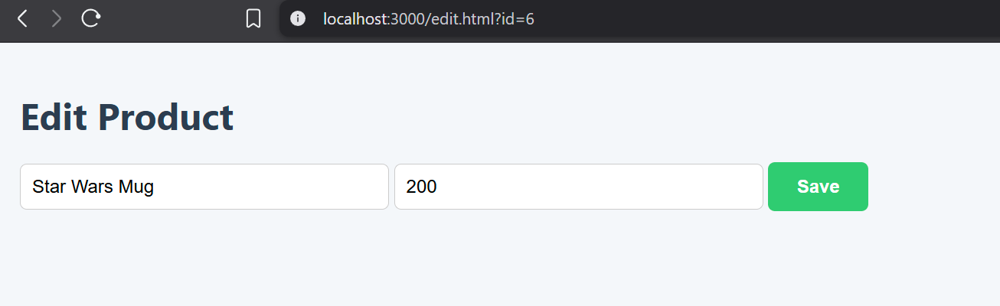

# Ejercicios con Express y Node.js

Este proyecto contiene tres ejercicios desarrollados con **Node.js** y **Express** que permiten practicar la creación de servidores, manejo de rutas REST y el consumo de APIs.

# 📌 Requisitos

Node.js

Postman (para pruebas de API)

Navegador web (para la interfaz con Axios)

## Screenshots

Ejercicio 2
[Ejercicio 2](assets/postmanPOST.png)

Ejercicio 3

Extras

